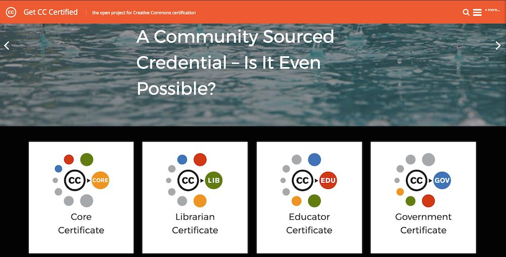

# CC-Certification Wordpress Stuff
blame Alan Levine • @cogdog • http://cog.dog

Plugins and themes used for the new Wordpress site https://certificates.creativecommons.org/ 

[CC-Cert Child Theme](wp-content/themes/cc-cert) based on [Cover](http://eichefam.net/projects/cover) 

## Plugins
* [Auto Post Thumbnail](https://wordpress.org/plugins/auto-post-thumbnail/) generate featured image from first found in post if not specified by author
* [Easy Theme and Plugin Upgrades](https://wordpress.org/plugins/easy-theme-and-plugin-upgrades/) to update custom themes w/o need for FTP access
* [Flickr Justified Gallery](https://wordpress.org/plugins/flickr-justified-gallery/)  beautiful galleries from flickr user, set, groups
* [Gravity Forms](http://www.gravityforms.com) $ everything and anything for forms that work with Wordpress content
* [Jetpack](https://wordpress.org/plugins/jetpack/) combo tool, the Cover theme uses several modules like infinite scroll, etc.
* [WP Video Lightbox](https://wordpress.org/plugins/wp-video-lightbox/) shows web video in overlay
